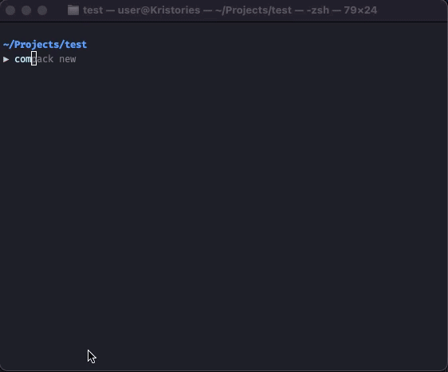

<p align="center"></p>

<p align="center">
<a href="https://github.com/devtical/compack/actions"></a>
<a href="https://packagist.org/packages/devtical/compack"></a>
<a href="https://packagist.org/packages/devtical/compack"></a>
<a href="https://packagist.org/packages/devtical/compack"></a>
</p>

## Introduction

Template-based composer package generator.

| Repository | Code |
|---|---|
| [Generic PHP](https://github.com/devtical/compack-template-generic) | `devtical/compack-template-generic`| 
| [Laravel](https://github.com/devtical/compack-template-laravel) | `devtical/compack-template-laravel` |
| Yours  | *Docs soon* |

## Installation

```bash
composer global require devtical/compack
```

Make sure to place composer's system-wide vendor bin directory in your `$PATH` so the compack executable can be located by your system. 

This directory exists in different locations based on your operating system; however, some common locations include:

| OS | Location |
|----|----------|
| macOS | `$HOME/.composer/vendor/bin` |
| Windows | `%USERPROFILE%\AppData\Roaming\Composer\vendor\bin` |
| GNU / Linux Distributions | `$HOME/.config/composer/vendor/bin` or `$HOME/.composer/vendor/bin` |

You could also find the composer's global installation path by running `composer global about` and looking up from the first line.

## Usage

Once installed, the `compack new` command will create a new package in the directory you specify.



### Template from directory

You can refer to the template from your local folder if you don't want to use the templates we provide on GitHub. This is also useful if you are developing templates.

```bash
Template Repository [devtical/compack-template-generic]:
> /Users/kristories/templates/my-awesome-template
```

## Change log

Please see the [changelog](CHANGELOG.md) for more information on what has changed recently.

## Testing

```bash
$ composer test
```

## Contributing

Please see [CONTRIBUTING.md](CONTRIBUTING.md) for details.

## Security

If you discover any security related issues, please email author instead of using the issue tracker.

## Credits

- [Wahyu Kristianto](https://github.com/devtical)
- [All contributors](https://github.com/devtical/compack/graphs/contributors)

## License

The MIT License (MIT). Please see the [license file](LICENSE.md) for more information.